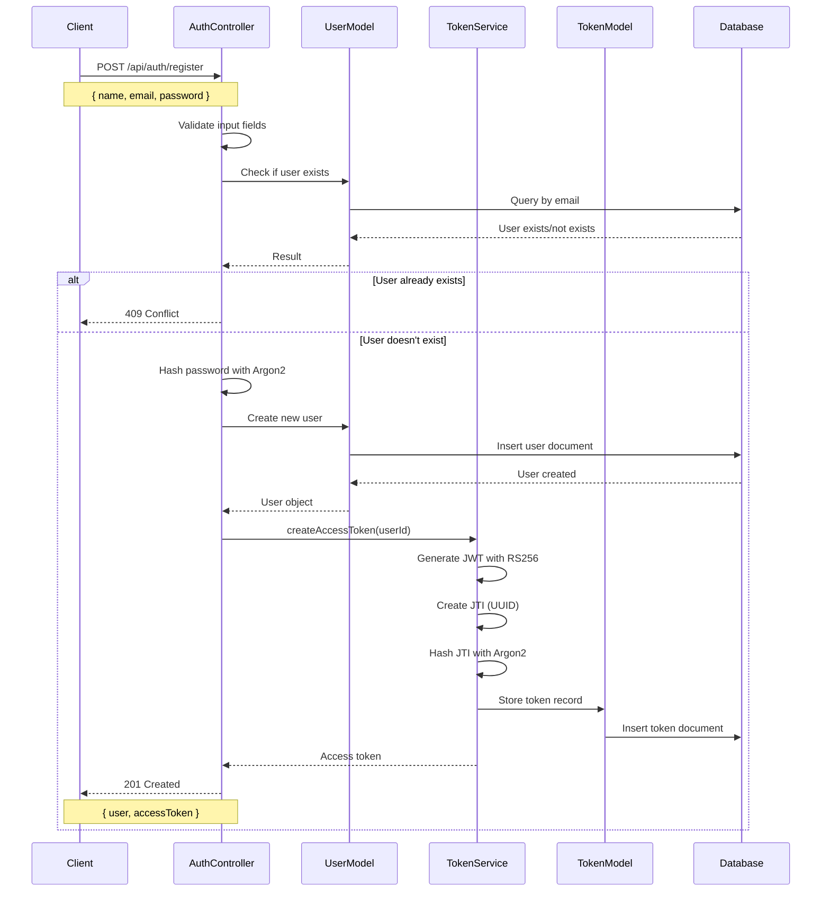
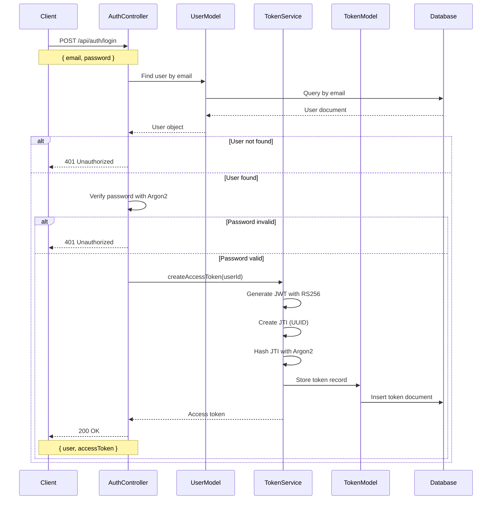
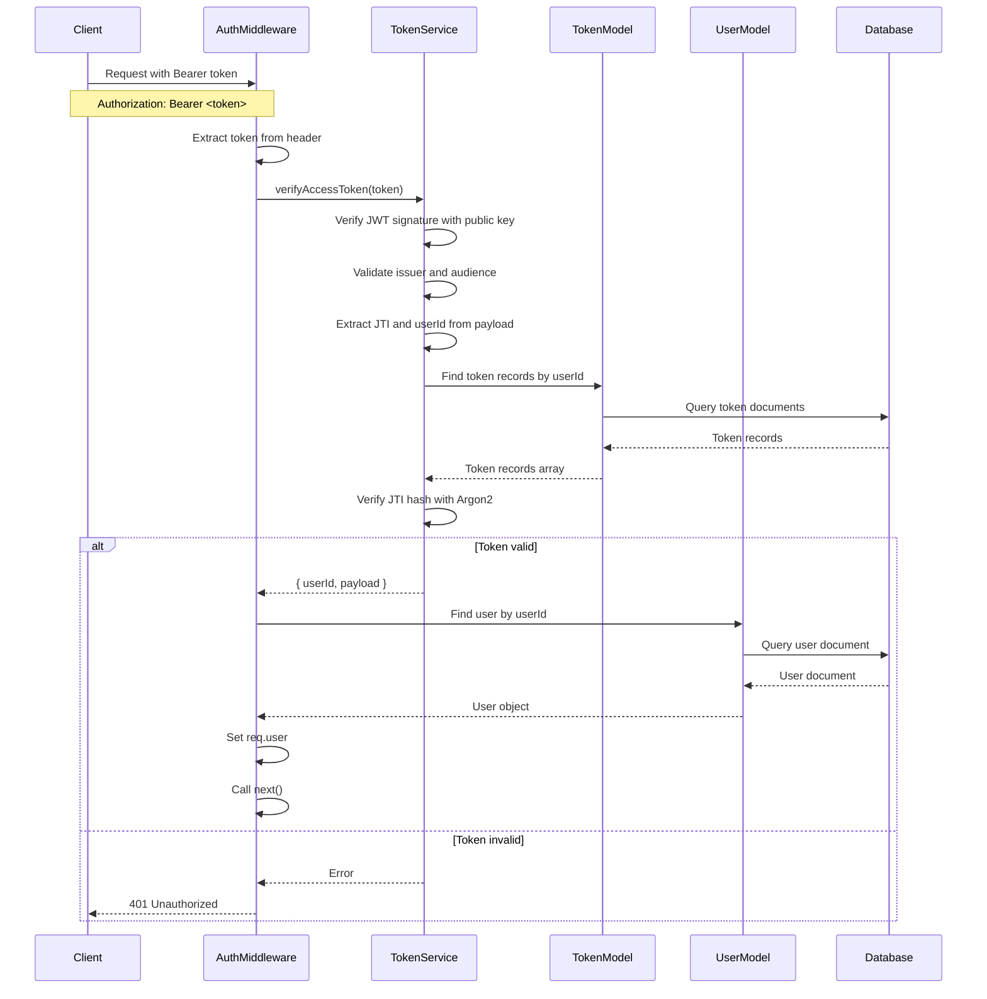
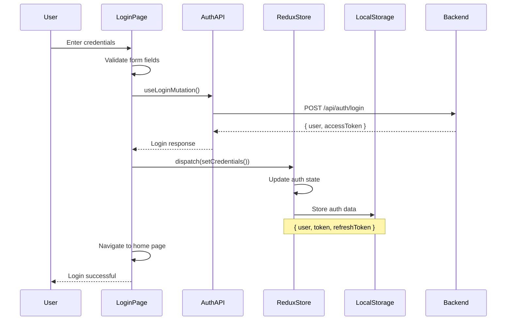
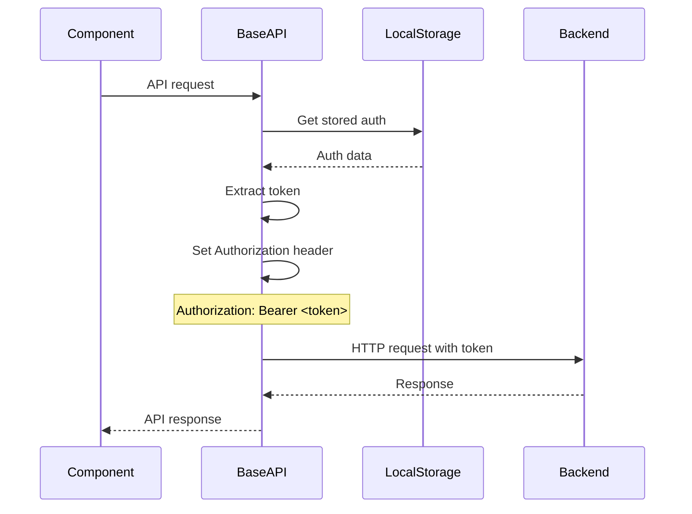
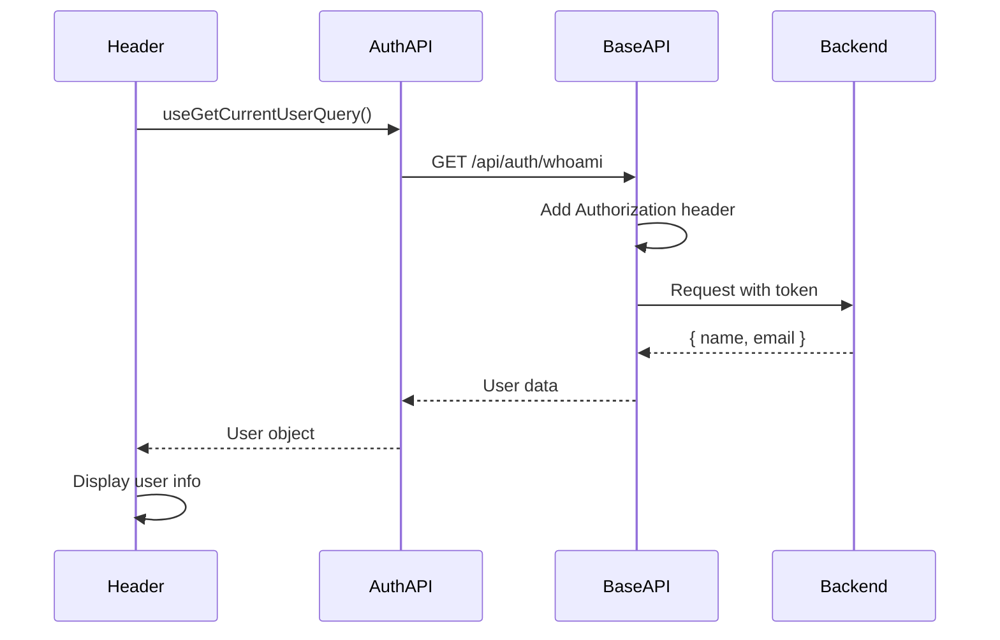

# Authentication Flow Documentation

## Overview

This document describes the complete authentication flow implemented in the GameHub application, covering both frontend and backend processes, security measures, and data flow.

## Table of Contents

1. [System Architecture](#system-architecture)
2. [Backend Authentication Flow](#backend-authentication-flow)
3. [Frontend Authentication Flow](#frontend-authentication-flow)
4. [Security Measures](#security-measures)
5. [Token Management](#token-management)
6. [Password Security](#password-security)
7. [API Endpoints](#api-endpoints)
8. [Error Handling](#error-handling)
9. [Database Schema](#database-schema)

## System Architecture

```
┌─────────────────┐    HTTP/HTTPS     ┌─────────────────┐
│   Frontend      │◄─────────────────►│   Backend       │
│   (React)       │                   │   (Express)     │
└─────────────────┘                   └─────────────────┘
         │                                     │
         │                                     │
         ▼                                     ▼
┌─────────────────┐                   ┌─────────────────┐
│   Redux Store   │                   │   MongoDB       │
│   (Token Storage)│                   │   (User Data)   │
└─────────────────┘                   └─────────────────┘
```

## Backend Authentication Flow

### 1. User Registration Process



### 2. User Login Process



### 3. Token Verification Process



## Frontend Authentication Flow

### 1. Login Process



### 2. Token Management



### 3. Current User Fetching



## Security Measures

### 1. Password Security

#### Argon2 Hashing
- **Algorithm**: Argon2id (default parameters)
- **Purpose**: Resistant to side-channel attacks and time-memory trade-off attacks
- **Implementation**: 
  ```typescript
  // Password hashing during registration
  const hash = await argon2.hash(password);
  
  // Password verification during login
  const isValid = await argon2.verify(user.passwordHash, password);
  ```

#### Password Requirements
- Minimum 8 characters
- Must contain uppercase letter
- Must contain lowercase letter
- Must contain number
- Must contain special character

### 2. Token Security

#### JWT Structure
```json
{
  "header": {
    "alg": "RS256",
    "typ": "JWT"
  },
  "payload": {
    "sub": "user_id",
    "iat": "issued_at_timestamp",
    "iss": "https://auth.local",
    "aud": "https://api.local",
    "jti": "unique_token_id",
    "exp": "expiration_timestamp"
  }
}
```

#### RS256 Signature
- **Algorithm**: RS256 (RSA with SHA-256)
- **Key Pair**: Generated using Web Crypto API
- **Private Key**: Used for signing tokens
- **Public Key**: Used for verifying tokens

#### JTI (JWT ID) Security
- **Purpose**: Token revocation and tracking
- **Generation**: Cryptographically secure UUID
- **Storage**: Hashed with Argon2 in database
- **Verification**: Hash comparison during token validation

### 3. CORS Configuration
```typescript
app.use(cors({ 
  origin: "http://localhost:8080", 
  credentials: true 
}));
```

### 4. Rate Limiting
```typescript
app.use(rateLimit({ 
  windowMs: 15 * 60 * 1000, // 15 minutes
  max: 100 // limit each IP to 100 requests per windowMs
}));
```

### 5. Security Headers
```typescript
app.use(helmet()); // Sets various security headers
```

## Token Management

### 1. Token Creation
```typescript
async createAccessToken(userId: ObjectId, expiresIn = 60 * 60) {
  const jti = randomUUID();
  const now = Math.floor(Date.now() / 1000);

  // Create JWT
  const token = await new SignJWT({ sub: userId.toString() })
    .setProtectedHeader({ alg: "RS256" })
    .setIssuedAt(now)
    .setIssuer("https://auth.local")
    .setAudience("https://api.local")
    .setJti(jti)
    .setExpirationTime(now + expiresIn)
    .sign(this.privateKey);

  // Hash JTI for storage
  const jtiHash = await this.hashJti(jti);
  
  // Store token record
  await TokenModel.create({
    userId,
    jtiHash,
    expiresAt: new Date(Date.now() + expiresIn * 1000),
  });

  return token;
}
```

### 2. Token Verification
```typescript
async verifyAccessToken(token: string) {
  // Verify JWT signature and claims
  const { payload } = await jwtVerify(token, this.publicKey, {
    issuer: "https://auth.local",
    audience: "https://api.local",
  });

  const jti = payload.jti as string;
  const userId = payload.sub as string;

  // Find token records for user
  const tokenRecords = await TokenModel.find({ 
    userId: new mongoose.Types.ObjectId(userId) 
  });

  // Verify JTI hash
  let validToken = false;
  for (const tokenRecord of tokenRecords) {
    const valid = await argon2.verify(tokenRecord.jtiHash, jti);
    if (valid) {
      validToken = true;
      break;
    }
  }

  if (!validToken) {
    throw new Error("Invalid or revoked token");
  }

  return { userId, payload };
}
```

### 3. Token Expiration
- **Default Duration**: 1 hour (3600 seconds)
- **Auto-cleanup**: MongoDB TTL index on `expiresAt` field
- **Refresh Strategy**: Currently requires re-login (can be extended with refresh tokens)

## API Endpoints

### Authentication Endpoints

#### POST /api/auth/register
- **Purpose**: Register new user
- **Request Body**:
  ```json
  {
    "name": "string",
    "email": "string",
    "password": "string"
  }
  ```
- **Response**:
  ```json
  {
    "message": "User registered successfully",
    "user": {
      "id": "string",
      "name": "string",
      "email": "string"
    },
    "accessToken": "string"
  }
  ```

#### POST /api/auth/login
- **Purpose**: Authenticate user
- **Request Body**:
  ```json
  {
    "email": "string",
    "password": "string"
  }
  ```
- **Response**:
  ```json
  {
    "user": {
      "id": "string",
      "name": "string",
      "email": "string"
    },
    "accessToken": "string"
  }
  ```

#### GET /api/auth/whoami
- **Purpose**: Get current user information
- **Headers**: `Authorization: Bearer <token>`
- **Response**:
  ```json
  {
    "name": "string",
    "email": "string"
  }
  ```

## Error Handling

### Backend Error Responses
```typescript
// 400 Bad Request
{ "errors": [{ "field": "email", "message": "Invalid email" }] }

// 401 Unauthorized
{ "message": "Unauthorized" }

// 409 Conflict
{ "message": "User exists" }
```

### Frontend Error Handling
```typescript
// Redux Toolkit Query error handling
const [login, { isLoading, error }] = useLoginMutation();

// Toast notifications
toast.error(err?.data?.message || 'Invalid credentials');
```

## Database Schema

### User Collection
```typescript
interface IUser {
  _id: ObjectId;
  name?: string;        // Optional for backward compatibility
  email: string;        // Unique, lowercase
  passwordHash: string; // Argon2 hash
  createdAt: Date;
  updatedAt: Date;
}
```

### Token Collection
```typescript
interface IToken {
  _id: ObjectId;
  userId: ObjectId;     // Reference to User
  jtiHash: string;      // Argon2 hash of JTI
  expiresAt: Date;      // TTL index for auto-cleanup
  createdAt: Date;
}
```

## Frontend State Management

### Redux Auth State
```typescript
interface AuthState {
  user: User | null;
  token: string | null;
  refreshToken?: string | null;
  isAuthenticated: boolean;
}
```

### Local Storage Structure
```json
{
  "user": {
    "id": "string",
    "name": "string",
    "email": "string"
  },
  "token": "jwt_token_string",
  "refreshToken": "optional_refresh_token"
}
```

## Security Best Practices Implemented

1. **Password Security**:
   - Argon2id hashing with secure parameters
   - Strong password requirements
   - No plaintext password storage

2. **Token Security**:
   - RS256 asymmetric encryption
   - JTI-based token tracking
   - Automatic token expiration
   - Token revocation capability

3. **API Security**:
   - CORS configuration
   - Rate limiting
   - Security headers (Helmet)
   - Input validation

4. **Data Protection**:
   - No sensitive data in JWT payload
   - Secure token storage in localStorage
   - Automatic cleanup of expired tokens

5. **Error Handling**:
   - Generic error messages to prevent information leakage
   - Proper HTTP status codes
   - Client-side error handling

## Future Enhancements

1. **Refresh Token Implementation**:
   - Long-lived refresh tokens
   - Automatic token refresh
   - Token rotation

2. **Multi-Factor Authentication**:
   - TOTP support
   - SMS verification
   - Email verification

3. **Session Management**:
   - Active session tracking
   - Remote logout capability
   - Session timeout

4. **Audit Logging**:
   - Login/logout events
   - Failed authentication attempts
   - Token usage tracking

This documentation provides a comprehensive overview of the authentication system, ensuring security, scalability, and maintainability of the authentication flow.
