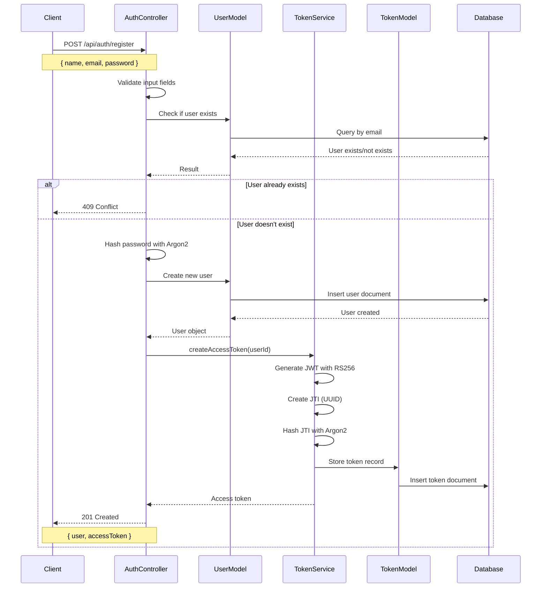
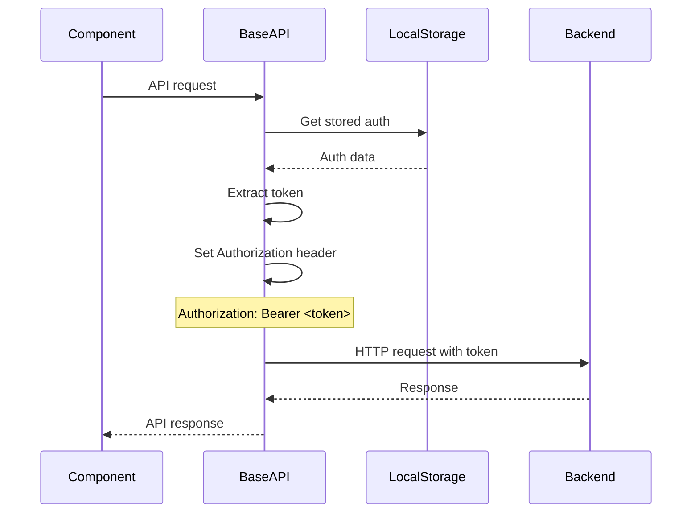
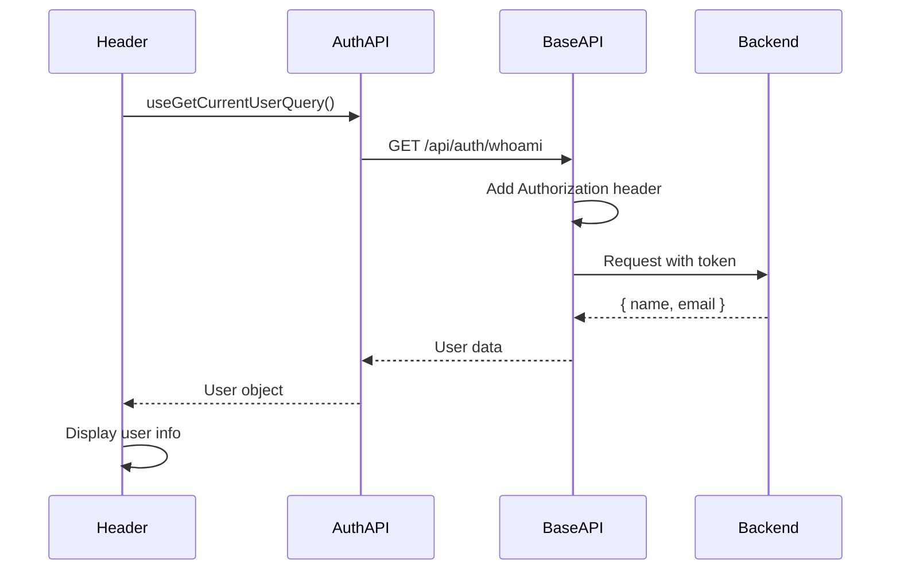

# Authentication Flow Documentation

## Overview

This document describes the complete authentication flow implemented in the GameHub application, covering both frontend and backend processes, security measures, and data flow.

## Table of Contents

1. [System Architecture](#system-architecture)
2. [Backend Authentication Flow](#backend-authentication-flow)
3. [Frontend Authentication Flow](#frontend-authentication-flow)
4. [Security Measures](#security-measures)
5. [Token Management](#token-management)
6. [Password Security](#password-security)
7. [API Endpoints](#api-endpoints)
8. [Error Handling](#error-handling)
9. [Database Schema](#database-schema)
10. [Multi-Factor Authentication (Email OTP)](#multi-factor-authentication-email-otp)
11. [Sessions and Security Events](#sessions-and-security-events)
12. [Frontend UX Updates](#frontend-ux-updates)

## System Architecture

```
┌─────────────────┐    HTTP/HTTPS     ┌─────────────────┐
│   Frontend      │◄─────────────────►│   Backend       │
│   (React)       │                   │   (Express)     │
└─────────────────┘                   └─────────────────┘
         │                                     │
         │                                     │
         ▼                                     ▼
┌─────────────────┐                   ┌─────────────────┐
│   Redux Store   │                   │   MongoDB       │
│   (Token Storage)│                   │   (User Data)   │
└─────────────────┘                   └─────────────────┘
```

## Backend Authentication Flow

### 1. User Registration Process


```mermaid
sequenceDiagram
    participant Client
    participant AuthController
    participant UserModel
    participant TokenService
    participant TokenModel
    participant Database

    Client->>AuthController: POST /api/auth/register
    Note over Client,AuthController: { name, email, password }

    AuthController->>AuthController: Validate input fields
    AuthController->>UserModel: Check if user exists
    UserModel->>Database: Query by email
    Database-->>UserModel: User exists/not exists
    UserModel-->>AuthController: Result

    alt User already exists
        AuthController-->>Client: 409 Conflict
    else User doesn't exist
        AuthController->>AuthController: Hash password with Argon2
        AuthController->>UserModel: Create new user
        UserModel->>Database: Insert user document
        Database-->>UserModel: User created
        UserModel-->>AuthController: User object

        AuthController->>TokenService: createAccessToken(userId)
        TokenService->>TokenService: Generate JWT with RS256
        TokenService->>TokenService: Create JTI (UUID)
        TokenService->>TokenService: Hash JTI with Argon2
        TokenService->>TokenModel: Store token record
        TokenModel->>Database: Insert token document
        TokenService-->>AuthController: Access token

        AuthController-->>Client: 201 Created
        Note over AuthController,Client: { user, accessToken }
    end
```

### 2. User Login Process

````mermaid
sequenceDiagram
    participant Client
    participant AuthController
    participant UserModel
    participant TokenService
    participant TokenModel
    participant Database

    Client->>AuthController: POST /api/auth/login
    Note over Client,AuthController: { email, password }

    AuthController->>UserModel: Find user by email
    UserModel->>Database: Query by email
    Database-->>UserModel: User document
    UserModel-->>AuthController: User object

    alt User not found
        AuthController-->>Client: 401 Unauthorized
    else User found
        AuthController->>AuthController: Verify password with Argon2
        alt Password invalid
            AuthController-->>Client: 401 Unauthorized
        else Password valid
            AuthController->>EmailService: sendOtp(email, code)
            EmailService-->>AuthController: sent
            AuthController-->>Client: { mfaRequired: true, userId }
        end
    end
### 2b. MFA (Email OTP) Verification

```mermaid
sequenceDiagram
    participant Client
    participant AuthController
    participant OtpCodeModel
    participant TokenService
    participant TokenModel
    participant RefreshTokenModel

    Client->>AuthController: POST /api/auth/verify-otp
    Note over Client,AuthController: { userId, code }

    AuthController->>OtpCodeModel: find latest for userId (not consumed, not expired)
    OtpCodeModel-->>AuthController: OTP record
    alt Invalid/Expired
        AuthController-->>Client: 401 Unauthorized
    else Valid
        AuthController->>OtpCodeModel: mark consumed
        AuthController->>TokenService: createAccessToken(userId)
        TokenService->>TokenModel: store JTI hash with expiry
        AuthController->>TokenService: createRefreshToken(userId)
        TokenService->>RefreshTokenModel: store tokenHash, userAgent/ip/expiry
        TokenService-->>AuthController: accessToken, refreshToken
        AuthController-->>Client: { user, accessToken, refreshToken }
    end
````

````

### 3. Token Verification Process

```mermaid
sequenceDiagram
    participant Client
    participant AuthMiddleware
    participant TokenService
    participant TokenModel
    participant UserModel
    participant Database

    Client->>AuthMiddleware: Request with Bearer token
    Note over Client,AuthMiddleware: Authorization: Bearer <token>

    AuthMiddleware->>AuthMiddleware: Extract token from header
    AuthMiddleware->>TokenService: verifyAccessToken(token)

    TokenService->>TokenService: Verify JWT signature with public key
    TokenService->>TokenService: Validate issuer and audience
    TokenService->>TokenService: Extract JTI and userId from payload

    TokenService->>TokenModel: Find token records by userId
    TokenModel->>Database: Query token documents
    Database-->>TokenModel: Token records
    TokenModel-->>TokenService: Token records array

    TokenService->>TokenService: Verify JTI hash with Argon2
    alt Token valid
        TokenService-->>AuthMiddleware: { userId, payload }
        AuthMiddleware->>UserModel: Find user by userId
        UserModel->>Database: Query user document
        Database-->>UserModel: User document
        UserModel-->>AuthMiddleware: User object

        AuthMiddleware->>AuthMiddleware: Set req.user
        AuthMiddleware->>AuthMiddleware: Call next()
    else Token invalid
        TokenService-->>AuthMiddleware: Error
        AuthMiddleware-->>Client: 401 Unauthorized
    end
````

## Frontend Authentication Flow

### 1. Login Process

```mermaid
sequenceDiagram
    participant User
    participant LoginPage
    participant AuthAPI
    participant ReduxStore
    participant LocalStorage
    participant Backend

    User->>LoginPage: Enter credentials
    LoginPage->>LoginPage: Validate form fields
    LoginPage->>AuthAPI: useLoginMutation()
    AuthAPI->>Backend: POST /api/auth/login
    Backend-->>AuthAPI: { user, accessToken }
    AuthAPI-->>LoginPage: Login response

    LoginPage->>ReduxStore: dispatch(setCredentials())
    ReduxStore->>ReduxStore: Update auth state
    ReduxStore->>LocalStorage: Store auth data
    Note over ReduxStore,LocalStorage: { user, token, refreshToken }

    LoginPage->>LoginPage: Navigate to home page
    LoginPage-->>User: Login successful
```

### 2. Token Management


```mermaid
sequenceDiagram
    participant Component
    participant BaseAPI
    participant LocalStorage
    participant Backend

    Component->>BaseAPI: API request
    BaseAPI->>LocalStorage: Get stored auth
    LocalStorage-->>BaseAPI: Auth data
    BaseAPI->>BaseAPI: Extract token
    BaseAPI->>BaseAPI: Set Authorization header
    Note over BaseAPI: Authorization: Bearer <token>
    BaseAPI->>Backend: HTTP request with token
    Backend-->>BaseAPI: Response
    BaseAPI-->>Component: API response
```

### 3. Current User Fetching


```mermaid
sequenceDiagram
    participant Header
    participant AuthAPI
    participant BaseAPI
    participant Backend

    Header->>AuthAPI: useGetCurrentUserQuery()
    AuthAPI->>BaseAPI: GET /api/auth/whoami
    BaseAPI->>BaseAPI: Add Authorization header
    BaseAPI->>Backend: Request with token
    Backend-->>BaseAPI: { name, email }
    BaseAPI-->>AuthAPI: User data
    AuthAPI-->>Header: User object
    Header->>Header: Display user info
```

## Security Measures

### 1. Password Security

#### Argon2 Hashing

- **Algorithm**: Argon2id (default parameters)
- **Purpose**: Resistant to side-channel attacks and time-memory trade-off attacks
- **Implementation**:

  ```typescript
  // Password hashing during registration
  const hash = await argon2.hash(password);

  // Password verification during login
  const isValid = await argon2.verify(user.passwordHash, password);
  ```

#### Password Requirements

- Minimum 8 characters
- Must contain uppercase letter
- Must contain lowercase letter
- Must contain number
- Must contain special character

### 2. Token Security

This project secures access with short-lived JWT access tokens (RS256) and long-lived opaque refresh tokens stored as hashes. Key properties:

- Access tokens: RS256-signed JWTs with strict claims validation (issuer, audience, exp). Include a unique `jti` for replay detection and revocation.
- Refresh tokens: Opaque UUIDs, never stored in plaintext. Only argon2 hashes are persisted along with expiry and metadata.
- Rotation: On refresh, the old refresh token is revoked and a new one is issued (rotation) to mitigate replay.

#### JWT structure

```json
{
  "header": { "alg": "RS256", "typ": "JWT" },
  "payload": {
    "sub": "<user_id>",
    "iat": 1710000000,
    "iss": "https://auth.local",
    "aud": "https://api.local",
    "jti": "<uuid>",
    "exp": 1710003600
  }
}
```

#### Signing (RS256) – backend example

```ts
// backend/src/services/TokenService.ts (excerpt)
import { SignJWT } from "jose";

async function createAccessToken(
  userId: string,
  privateKey: CryptoKey,
  expiresInSeconds = 3600
) {
  const now = Math.floor(Date.now() / 1000);
  const jti = crypto.randomUUID();
  const token = await new SignJWT({ sub: userId })
    .setProtectedHeader({ alg: "RS256" })
    .setIssuedAt(now)
    .setIssuer("https://auth.local")
    .setAudience("https://api.local")
    .setJti(jti)
    .setExpirationTime(now + expiresInSeconds)
    .sign(privateKey);

  // Persist the JTI hash for revocation checks
  const jtiHash = await argon2.hash(jti);
  await TokenModel.create({
    userId,
    jtiHash,
    expiresAt: new Date((now + expiresInSeconds) * 1000),
  });
  return token;
}
```

#### Verification and JTI check

```ts
// backend/src/services/TokenService.ts (excerpt)
import { jwtVerify } from "jose";

async function verifyAccessToken(token: string, publicKey: CryptoKey) {
  const { payload } = await jwtVerify(token, publicKey, {
    issuer: "https://auth.local",
    audience: "https://api.local",
  });

  const jti = payload.jti as string;
  const userId = payload.sub as string;

  // Look up all token records for user and validate JTI via argon2 verify
  const tokenRecords = await TokenModel.find({ userId });
  let valid = false;
  for (const rec of tokenRecords) {
    if (await argon2.verify(rec.jtiHash, jti)) {
      valid = true;
      break;
    }
  }
  if (!valid) throw new Error("Invalid or revoked token");
  return { userId, payload };
}
```

#### Refresh tokens – storage and rotation

```ts
// Creation (opaque value only given to client once)
const refreshRaw = crypto.randomUUID();
await RefreshTokenModel.create({
  userId,
  tokenHash: await argon2.hash(refreshRaw),
  expiresAt: new Date(Date.now() + 30 * 24 * 60 * 60 * 1000),
});

// Verification and rotation
const records = await RefreshTokenModel.find({ userId, revoked: false });
const match = await Promise.any(records.map(r => argon2.verify(r.tokenHash, providedRefreshToken)));
if (!match) throw new Error("Refresh token invalid");

// Revoke old and issue new
matchedRecord.revoked = true; await matchedRecord.save();
const nextRaw = crypto.randomUUID();
await RefreshTokenModel.create({ userId, tokenHash: await argon2.hash(nextRaw), expiresAt: /* +30d */ });
```

#### Claim validation and error handling

- Always validate `iss`, `aud`, `exp` during verification.
- Treat any verification exception as `401 Unauthorized` and avoid leaking details.
- Short lifetimes for access tokens reduce exposure; rely on refresh flow.

#### TTL and cleanup

MongoDB TTL indexes automatically remove expired rows:

```ts
// Example in Mongoose schema
expiresAt: { type: Date, required: true, index: { expires: 0 } }
```

#### Security considerations

- Do not store refresh tokens in plaintext; only store argon2 hashes.
- Rotate refresh tokens on each use; revoke previous token to prevent reuse.
- Use RS256 (asymmetric) for JWTs to separate signing (server) from verification.
- Keep key material in memory; regenerate keys on boot if appropriate, or load from secure storage for multi-instance setups.
- Limit token scope and audience; avoid embedding sensitive data in JWT payloads.

### 3. CORS Configuration

```typescript
app.use(
  cors({
    origin: "http://localhost:8080",
    credentials: true,
  })
);
```

### 4. Rate Limiting

```typescript
app.use(
  rateLimit({
    windowMs: 15 * 60 * 1000, // 15 minutes
    max: 100, // limit each IP to 100 requests per windowMs
  })
);
```

### 5. Security Headers

```typescript
app.use(helmet()); // Sets various security headers
```

## Token Management

### 1. Token Creation

```typescript
async createAccessToken(userId: ObjectId, expiresIn = 60 * 60) {
  const jti = randomUUID();
  const now = Math.floor(Date.now() / 1000);

  // Create JWT
  const token = await new SignJWT({ sub: userId.toString() })
    .setProtectedHeader({ alg: "RS256" })
    .setIssuedAt(now)
    .setIssuer("https://auth.local")
    .setAudience("https://api.local")
    .setJti(jti)
    .setExpirationTime(now + expiresIn)
    .sign(this.privateKey);

  // Hash JTI for storage
  const jtiHash = await this.hashJti(jti);

  // Store token record
  await TokenModel.create({
    userId,
    jtiHash,
    expiresAt: new Date(Date.now() + expiresIn * 1000),
  });

  return token;
}
```

### 2. Token Verification

```typescript
async verifyAccessToken(token: string) {
  // Verify JWT signature and claims
  const { payload } = await jwtVerify(token, this.publicKey, {
    issuer: "https://auth.local",
    audience: "https://api.local",
  });

  const jti = payload.jti as string;
  const userId = payload.sub as string;

  // Find token records for user
  const tokenRecords = await TokenModel.find({
    userId: new mongoose.Types.ObjectId(userId)
  });

  // Verify JTI hash
  let validToken = false;
  for (const tokenRecord of tokenRecords) {
    const valid = await argon2.verify(tokenRecord.jtiHash, jti);
    if (valid) {
      validToken = true;
      break;
    }
  }

  if (!validToken) {
    throw new Error("Invalid or revoked token");
  }

  return { userId, payload };
}
```

### 3. Refresh Token Rotation

- Long-lived refresh tokens are opaque UUIDs, stored hashed (`argon2`) in `RefreshToken` collection with TTL and metadata.
- On access token expiry (401), the frontend calls `/auth/refresh` with `{ userId, refreshToken }`.
- Backend verifies hash, revokes current refresh token, creates a new one (rotation), and issues a new access token.

```typescript
// POST /auth/refresh handler (simplified)
await tokenService.verifyRefreshToken(userId, refreshToken);
const accessToken = await tokenService.createAccessToken(new ObjectId(userId));
const newRefreshToken = await tokenService.rotateRefreshToken(
  new ObjectId(userId),
  refreshToken
);
return res.json({ accessToken, refreshToken: newRefreshToken });
```

### 3. Token Expiration

- **Default Duration**: 1 hour (3600 seconds)
- **Auto-cleanup**: MongoDB TTL index on `expiresAt` field
- **Refresh Strategy**: Currently requires re-login (can be extended with refresh tokens)

Updated:

- Refresh tokens implemented with rotation; automatic refresh on 401 in frontend.

## API Endpoints

### Authentication Endpoints

#### POST /api/auth/register

- **Purpose**: Register new user
- **Request Body**:
  ```json
  {
    "name": "string",
    "email": "string",
    "password": "string"
  }
  ```
- **Response**:
  ```json
  {
    "message": "User registered successfully",
    "user": {
      "id": "string",
      "name": "string",
      "email": "string"
    },
    "accessToken": "string"
  }
  ```

#### POST /api/auth/login

- **Purpose**: Begin authentication; send OTP if credentials are valid
- **Request Body**:
  ```json
  {
    "email": "string",
    "password": "string"
  }
  ```
- **Response**:
  - If MFA required:
    ```json
    { "mfaRequired": true, "userId": "string" }
    ```
  - Otherwise (if MFA disabled):
    ```json
    {
      "user": { "id": "string", "name": "string", "email": "string" },
      "accessToken": "string",
      "refreshToken": "string"
    }
    ```

#### POST /api/auth/verify-otp

- **Purpose**: Verify email OTP and issue tokens
- **Request Body**:
  ```json
  { "userId": "string", "code": "123456" }
  ```
- **Response**:
  ```json
  {
    "user": { "id": "string", "name": "string", "email": "string" },
    "accessToken": "string",
    "refreshToken": "string"
  }
  ```

#### POST /api/auth/resend-otp

- **Purpose**: Resend OTP to email
- **Request Body**:
  ```json
  { "userId": "string" }
  ```
- **Response**:
  ```json
  { "message": "OTP resent" }
  ```

#### GET /api/auth/whoami

#### POST /api/auth/refresh

- **Purpose**: Rotate refresh token and issue a new access token
- **Request Body**: `{ "userId": "string", "refreshToken": "string" }`
- **Response**: `{ "accessToken": "string", "refreshToken": "string" }`

#### GET /api/auth/sessions

- **Purpose**: List refresh-token sessions for the authenticated user
- **Auth**: Bearer access token
- **Response**: Array of `{ id, revoked, createdAt, expiresAt, userAgent?, ip? }`

#### POST /api/auth/sessions/revoke

- **Purpose**: Revoke a specific refresh-token session
- **Auth**: Bearer access token
- **Request Body**: `{ "sessionId": "string" }`
- **Response**: `{ "message": "Session revoked" }`
- **Purpose**: Get current user information
- **Headers**: `Authorization: Bearer <token>`
- **Response**:
  ```json
  {
    "name": "string",
    "email": "string"
  }
  ```

## Error Handling

### Backend Error Responses

```typescript
// 400 Bad Request
{ "errors": [{ "field": "email", "message": "Invalid email" }] }

// 401 Unauthorized
{ "message": "Unauthorized" }

// 409 Conflict
{ "message": "User exists" }
```

### Frontend Error Handling

```typescript
// Redux Toolkit Query error handling
const [login, { isLoading, error }] = useLoginMutation();

// Toast notifications
toast.error(err?.data?.message || "Invalid credentials");
```

## Database Schema

### User Collection

```typescript
interface IUser {
  _id: ObjectId;
  name?: string; // Optional for backward compatibility
  email: string; // Unique, lowercase
  passwordHash: string; // Argon2 hash
  createdAt: Date;
  updatedAt: Date;
}
```

### Token Collection

```typescript
interface IToken {
  _id: ObjectId;
  userId: ObjectId; // Reference to User
  jtiHash: string; // Argon2 hash of JTI
  expiresAt: Date; // TTL index for auto-cleanup
  createdAt: Date;
}
```

### RefreshToken Collection

```typescript
interface IRefreshToken {
  _id: ObjectId;
  userId: ObjectId; // Reference to User
  tokenHash: string; // Argon2 hash of opaque refresh token
  expiresAt: Date; // TTL index for auto-cleanup
  revoked: boolean;
  replacedByTokenHash?: string;
  userAgent?: string;
  ip?: string;
  createdAt: Date;
  updatedAt: Date;
}
```

### OtpCode Collection

```typescript
interface IOtpCode {
  _id: ObjectId;
  userId: ObjectId;
  codeHash: string; // Argon2 hash of 6-digit code
  expiresAt: Date; // ~5 minutes
  consumed: boolean; // Prevent reuse
  channel: "email";
  createdAt: Date;
  updatedAt: Date;
}
```

## Multi-Factor Authentication (Email OTP)

### Overview

- After password verification, the backend sends a 6-digit OTP to the user's email using SMTP (Nodemailer).
- Backend stores only a hash of the OTP, with a 5-minute expiry, and marks it consumed after use.
- The client submits the OTP via `/auth/verify-otp` to receive access and refresh tokens.

### SMTP Configuration

Set the following environment variables for the backend:

```
SMTP_HOST=smtp.gmail.com
SMTP_PORT=465
SMTP_SECURE=true
SENDER_EMAIL=youraddress@gmail.com
SENDER_PASSWORD=your_app_password
```

## Sessions and Security Events

- Sessions are represented by refresh tokens (hashed) with metadata (userAgent, ip, createdAt, expiresAt, revoked).
- The dashboard lists active sessions and allows revocation via `/auth/sessions` and `/auth/sessions/revoke`.
- Security events are derived from refresh-token lifecycle (issued, rotated, revoked) and exposed at `/auth/security-events`.

## Frontend UX Updates

- Login now supports a two-step flow: credentials → OTP.
- Token countdown UI decodes `exp` from JWT and updates every second.
- Automatic token refresh is handled in a wrapped base query that retries the original request after a successful `/auth/refresh`.
- Dashboard widgets display token status, sessions with revoke controls, and recent security events.

## Frontend State Management

### Redux Auth State

```typescript
interface AuthState {
  user: User | null;
  token: string | null;
  refreshToken?: string | null;
  isAuthenticated: boolean;
}
```

### Local Storage Structure

```json
{
  "user": {
    "id": "string",
    "name": "string",
    "email": "string"
  },
  "token": "jwt_token_string",
  "refreshToken": "optional_refresh_token"
}
```

## Security Best Practices Implemented

1. **Password Security**:

   - Argon2id hashing with secure parameters
   - Strong password requirements
   - No plaintext password storage

2. **Token Security**:

   - RS256 asymmetric encryption
   - JTI-based token tracking
   - Automatic token expiration
   - Token revocation capability

3. **API Security**:

   - CORS configuration
   - Rate limiting
   - Security headers (Helmet)
   - Input validation

4. **Data Protection**:

   - No sensitive data in JWT payload
   - Secure token storage in localStorage
   - Automatic cleanup of expired tokens

5. **Error Handling**:
   - Generic error messages to prevent information leakage
   - Proper HTTP status codes
   - Client-side error handling

## Future Enhancements

1. **Refresh Token Implementation**:

   - Long-lived refresh tokens
   - Automatic token refresh
   - Token rotation

2. **Multi-Factor Authentication**:

   - TOTP support
   - SMS verification
   - Email verification

3. **Session Management**:

   - Active session tracking
   - Remote logout capability
   - Session timeout

4. **Audit Logging**:
   - Login/logout events
   - Failed authentication attempts
   - Token usage tracking

This documentation provides a comprehensive overview of the authentication system, ensuring security, scalability, and maintainability of the authentication flow.
